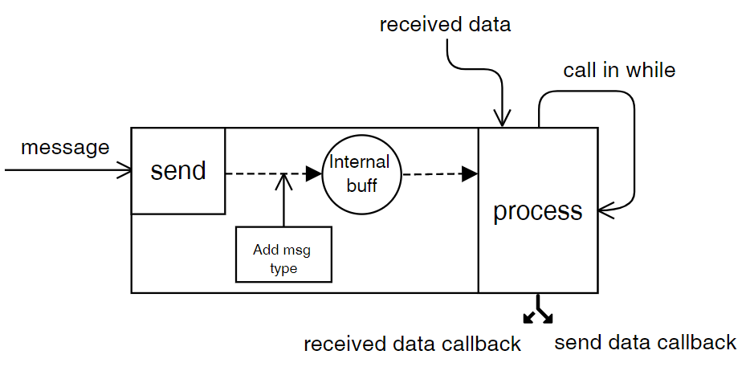

# Porter
Library to guarantee data delivery

<p align="center">
  
</p>

## Overview
The library was created to organize the guarantee of data delivery over the data transmission channel. The library works in sequential mode (does not support waterfalls) and has no internal FIFO buffers.
<p align="center">
  
</p>

## How to use
#### Init Porter
```c
#define DATA_LENGTH 8
porter_t porter;

void user_send_callback(const uint8_t *data, const uint8_t length);
void user_recv_callback(const uint8_t *data, const uint8_t length);
void user_tx_free_callback(void);

uint8_t initResult = porter_init(&porter, DATA_LENGTH, user_send_callback, user_recv_callback, 100);
if (initResult != PORTER_OK) {
  //handle error
}

porter_set_tx_free_callback(&porter, user_tx_free_callback);
```

#### In main loop call read
If there is no received data:
```c
porter_process(&porter1, NULL, 0, clock());
```
If there is received data:
```c
porter_process(&porter1, receive_data, receive_data_length, clock());
```

#### Send data
```c
uint8_t data[] = {1, 2, 3, 4, 5, 6, 7, 8};
uint8_t sendResult = porter_send(&porter, data, 8);
if (sendResult != PORTER_OK) {
  //handle error
}
```

#### Deinit Porter
```c
porter_deinit(&porter);
```

## Functions description
```c
/*!
 * \brief porter_init Set initial values
 * \param porter - address of sheller descriptor
 * \param max_data_length - maximum length of transmitted data
 * \param send_callback - function that is called when a message is sent
 * \param recv_callback - function that is called when a message is received
 * \param timeout_ms - time for which acknowledgement should come
 * \return result of init porter
 */
uint8_t porter_init(porter_t *porter,
                    uint8_t max_data_length,
                    void (*send_callback)(const uint8_t *data, const uint8_t data_length),
                    void (*recv_callback)(const uint8_t *data, const uint8_t data_length),
                    porter_time_t timeout_ms);
```

```c
/*!
 * \brief porter_deinit Free memory
 * \param porter - address of sheller descriptor
 * \return
 */
uint8_t porter_deinit(porter_t *porter);
```

```c
/*!
 * \brief porter_send Push data to an internal buffer to send later
 * \param porter - address of sheller descriptor
 * \param data - pointer to user data which need to send
 * \param data_length - length of user data
 * \return result of pushing data to an internal buffer
 */
uint8_t porter_send(porter_t *porter, const uint8_t *data, const uint8_t data_length)
```

```c
/*!
 * \brief porter_process Proceed work of Porter
 * \param porter - address of sheller descriptor
 * \param received_data - pointer on received data
 * \param received_data_length - length of received data
 * \param current_time - current system time in ms
 * \return result of proceed work
 * \details this function call callbacks: tx_free_callback, send_callback, recv_callback
 */
uint8_t porter_process(porter_t *porter, const uint8_t *received_data, const uint8_t received_data_length, porter_time_t current_time)
```

```c
/*!
 * \brief porter_is_tx_free
 * \param porter - address of sheller descriptor
 * \return tx buffer status
 * \details compare the return value with PORTER_TX_BUSY or PORTER_TX_FREE
 */
uint8_t porter_is_tx_free(porter_t *porter)
```

```c
/*!
 * \brief porter_set_tx_free_callback
 * \param porter - address of sheller descriptor
 * \return status of set callback
 */
uint8_t porter_set_tx_free_callback(porter_t *porter, void (*tx_free_callback)())
```

## Tests
You can run the tests for Porter to make sure it works: [BaseTest_Porter](https://github.com/VNovytskyi/BaseTest_Porter)
